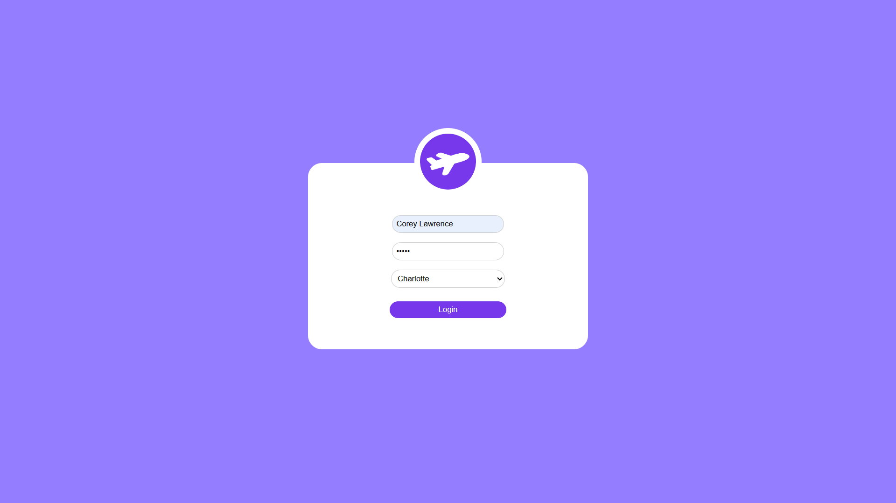
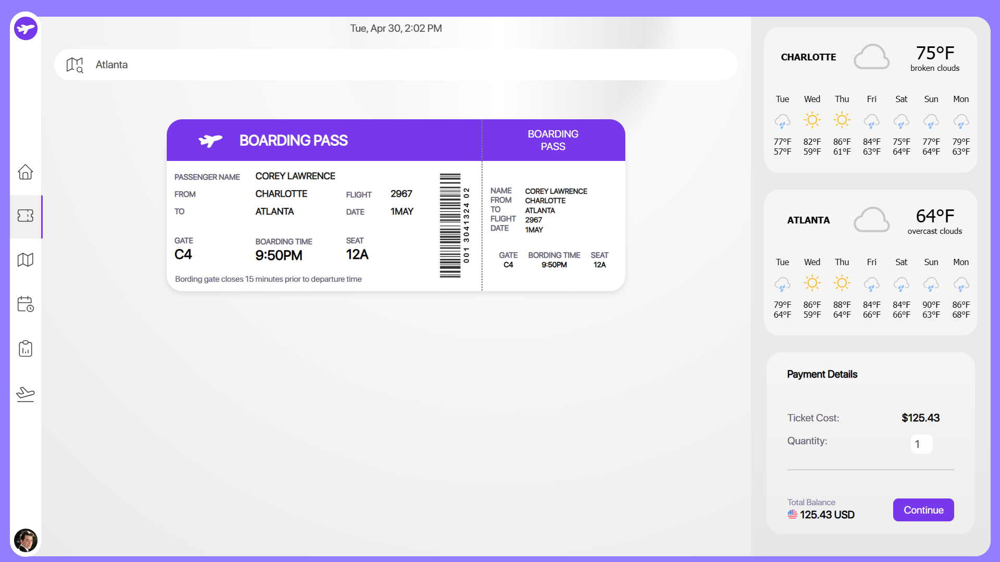
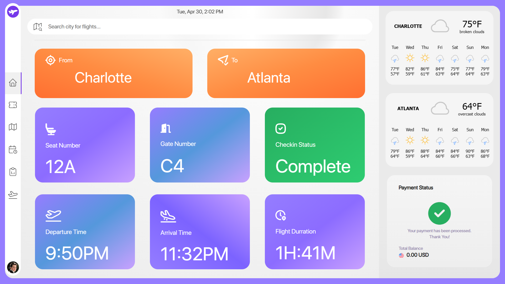
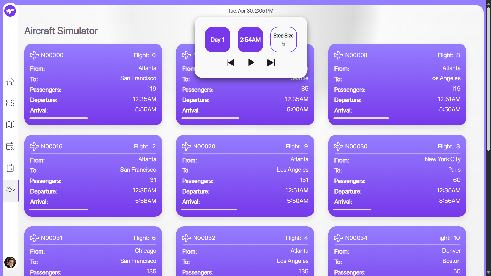
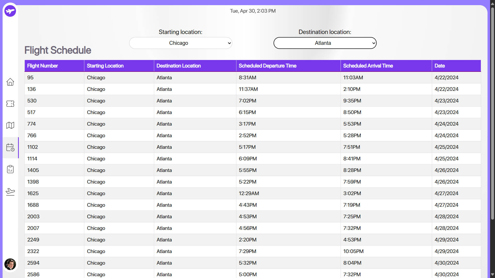

# Comfort Airlines Aircraft Simulator

This simulator offers a seamless and user-friendly experience for exploring the intricacies of airline operations. With just Python installed, users can effortlessly navigate the simulation by running a single script (`run.py`). The well-designed graphical interface provides intuitive access to various features, from purchasing tickets to monitoring flight schedules and financial reports. Its simplicity in setup and usage makes it an accessible tool for understanding the complexities of running an airline venture.

## Screenshots

**Login Page**
   

**Flight Selection Page with Dynamically Filled Boarding Pass**
   

**User Dashboard**
   

**Aircraft Simulator**
   

**Timetable**
   

## Background
- Comfort Airlines is a startup airline venture initiated by a group of wealthy investors aiming to provide excellent service at reasonable prices.
- The investors have decided to develop a simulation to explore the feasibility of their business plan and understand the logistics involved in running an airline.
- The goal is to make a profit while providing excellent service to gain a competitive advantage over existing large airlines.

## FAA Authorization
- The FAA has granted Comfort Airlines authority to fly in and out of the top 30 US airports as defined by [Wikipedia](https://en.wikipedia.org/wiki/List_of_the_busiest_airports_in_the_United_States).

## Aircraft Fleet
- Comfort Airlines has secured a fleet of aircraft including:
  - 15 Boeing 737-600
  - 15 Boeing 737-800
  - 12 Airbus A200-100
  - 13 Airbus A220-300
- Leasing costs, maintenance details, and other specifications are provided.

## Simulation Process
- Python scripts are used to generate input data for the simulation.
- To run the simulation:
  1. Clone the repository.
  2. Run the provided python script (`run.py`) to generate initial simulation data.
- The simulation runs for a two-week period, servicing passengers and generating reports.
- The simulation adheres to specified criteria, including flight time calculations and aircraft turnaround times.
- After the simulation has run, the GUI will be launched automatically.

## Graphical User Interface (GUI)
- The GUI provides an intuitive user experience for interacting with the simulation results and reports.
- Users input their name, a demo password (no actual password needed), and select their starting location.
- They can then access various features:
  - **Ticket Purchasing**: Users can search for available flights, choose one, and view a boarding pass with flight and passenger details.
  - **Dashboard**: Users can view their flight details in a clear format.
  - **Timetable**: A filterable timetable allows users to view flight schedules.
  - **Aircraft Simulation Page**: Users can view what each of the 56 aircraft were doing throughout the entire simulation. They can see source airport, destination airport, passengers on board, and progress through the flight, which is shown through a loading bar for each plane.
- The GUI also includes playback controls for financial reports and aircraft simulation details, enabling users to see profits increment throughout the simulation.

## Profit
- In the two-week simulation, the airline was able to service 400,597 passengers over 3,475 flights.
- This resulted in a net profit of $263,348,045 per simulated month, showcasing the efficacy of the greedy algorithm used in the simulation.

## How to Use
1. Clone the repository to the directory of your choosing.
2. Execute the provided `run.py` script in the root folder to generate initial simulation data and run the simulation. The user interface will launch automatically upon completion.
3. Once the simulation data is generated, it does not need to be generated again. To run the GUI without regenerating the data, execute `python3 ./webdriver.py`.
